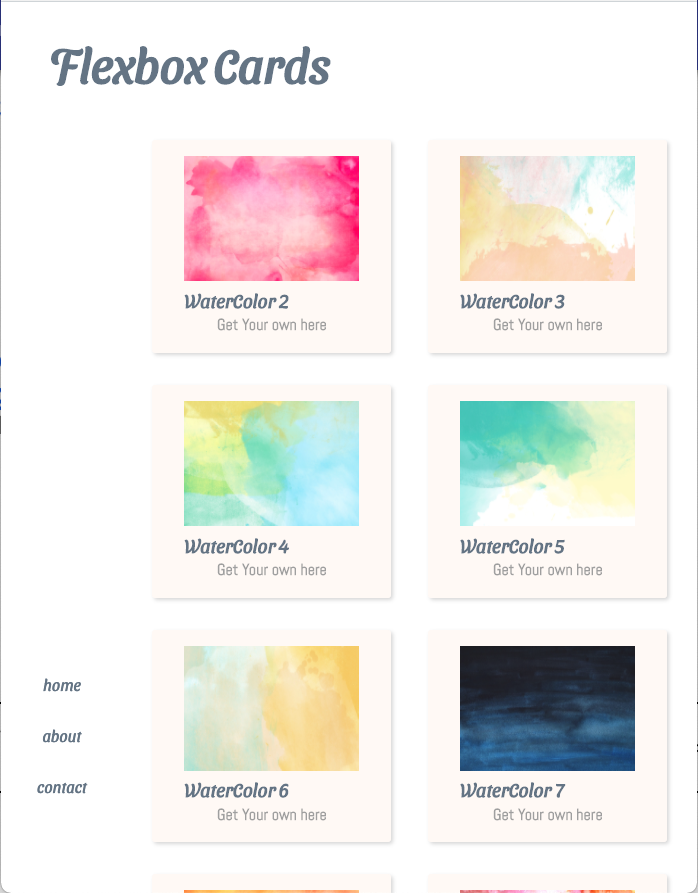
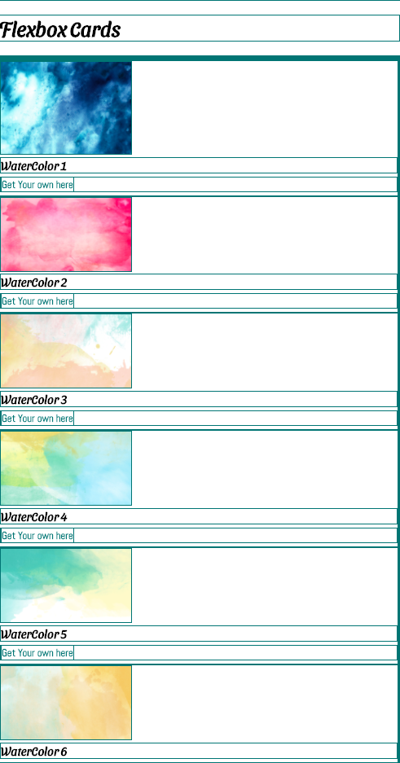
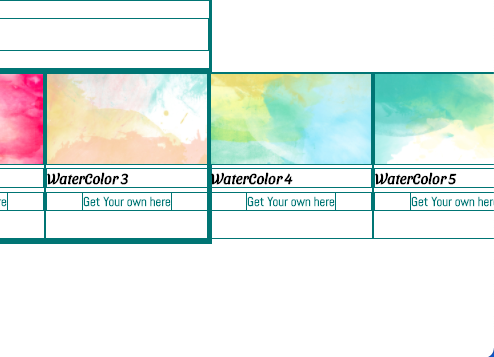
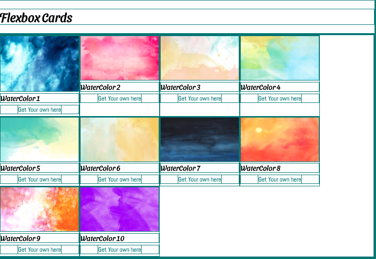

# Intro to Flexbox Code Along

Remember the Documentation:

[Flexbox was created to create a more efficient way to lay out, align and distribute space in a container - especially when the size is unknown or dynamic. - CSS Tricks](https://css-tricks.com/snippets/css/a-guide-to-flexbox/)

## What we are building

We will use flexbox to build a simple watercolor swatch site.

##### Wide view:


##### Narrow view:




## Getting Started

Let's open our code and see what is there
 - complete index.html
 - `code-along.css` - this is where we will do all our work

add a universal rule to draw a gold (easier to remember 1px solid gold) or teal (easier to see) border around every element.

```css
* {
  border: 1px solid teal;
}
```



Web page structure

all elements are wrapped in a div with a class of wrapper.
Within the wrapper:
 - h1 tag
 - main with a class of container
  - main has two elements
    - aside (that has a navigation and unordered list)
    - section (that contains our 'cards')

For now, our navigation has a display none, so we can focus styling our cards first.


We will see that each of our `cards` that has an image, an h3 tag and an anchor tag inside an h4 tag and they are block elements.

There are two styling elements in flex - parents and containers

Unlike other CSS declarations, display flex only targets the immediate children

```css
section  {
  display:flex;
}
```

We now have all of our cards as flex items, but they extend past their container.



Let's add a declaration so that the items wrap to the next line

```css
section  {
  display:flex;
  flex-wrap: wrap;
}

```



**Note**: different amounts of cards may be on each row, depending on the width of your browser

### Justify Content

How do we space out our cards evenly?

We can justify the content and there are a few options - let's try a few


```css
section  {
  display:flex;
  flex-wrap: wrap;
  justify-content: center;
}

```


```css
section  {
  display: flex;
  flex-wrap: wrap;
  /* justify-content: center; */
  /* justify-content: space-around; */
  /* justify-content: space-between; */
  justify-content: space-evenly;
}

```


Now let's work on setting up our navigation

comment out display none

Very little space is given to our nav

Let's set a min width. min-width can work, but when using flexbox it has it's own declaration for min-width called 'flex-basis', usinig this will give us more expected behavoir

Let's make the aside be 20% and the section be 80%

Let's vertically center our nav

Make aside flex container


[Further, flexsporer](https://bennettfeely.com/flexplorer/)
[Flexbox Froggy](https://flexboxfroggy.com/)
